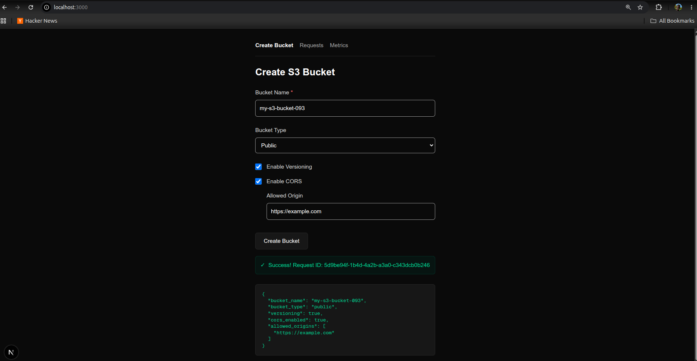
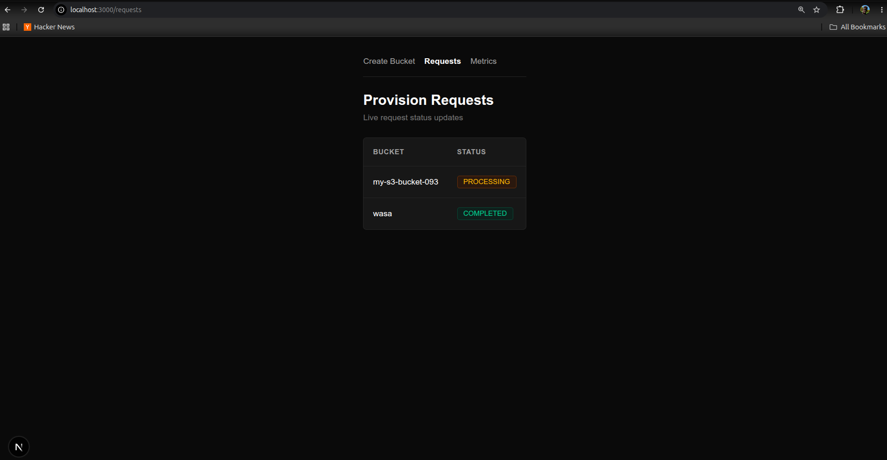
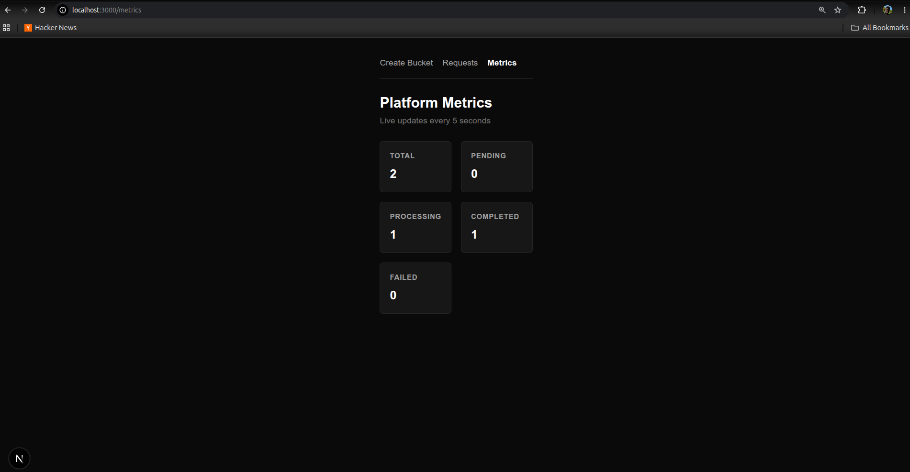

# S3 Provisioning Dashboard

A lightweight developer dashboard for provisioning.

Built with **Next.js**, **TypeScript**, and **SWR**, the application provides a simple interface for creating S3 buckets, tracking provisioning requests real time.

---

## Overview

Managing cloud resources often requires jumping between multiple tools and dashboards. This project provides a single interface where users can:

* Create and configure AWS S3 buckets
* Track provisioning requests as they move through the system
* Monitor platform health and operational metrics
* Receive near real-time updates through lightweight polling

---

## Features

### S3 Bucket Provisioning

Create AWS S3 buckets through a guided form with support for:

* Public and Private bucket configurations
* Bucket versioning
* CORS configuration for public buckets
* Client-side validation
* Disabled submission for incomplete inputs

### Request Monitoring

Track infrastructure provisioning jobs through a dedicated requests view.

* View pending requests
* Monitor active provisioning tasks
* Track completed operations
* Automatic status refresh using SWR polling

### Platform Metrics

Monitor system health through a metrics dashboard.

Examples include:

* Total provisioning requests
* Success and failure counts
* Active jobs

---

## Project Structure

```text
src
├── app
│   ├── page.tsx
│   ├── requests
│   │   └── page.tsx
│   └── metrics
│       └── page.tsx
│
├── components
│   └── BucketFormFields.tsx
│
├── lib
│   └── api.ts
│
└── types
    └── bucket.ts
```

## Environment Configuration

Create a `.env` file in the project root:

```env
BASE_URL=http://localhost:8000
```

This should point to the provisioning backend service.

---

## Installation

Clone the repository and install dependencies:

```bash
npm install
```
---

## Running Locally

Start the development server:

```bash
npm run dev
```

Open:

```text
http://localhost:3000
```

in your browser.

---

## Data Fetching Strategy

The dashboard uses **SWR** for efficient client-side data synchronization.

### Polling Behaviour

* Requests page refreshes automatically
* Metrics page refreshes automatically
* Polling interval: **5 seconds**
* Revalidation pauses when the browser tab is inactive

---

## Screenshots

Add screenshots of:





