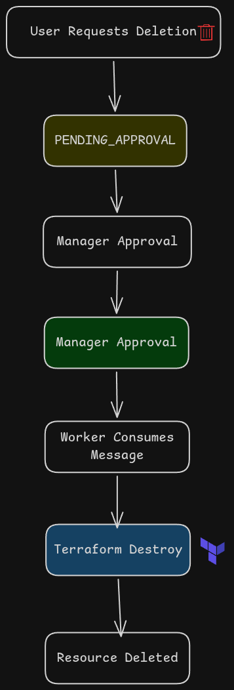
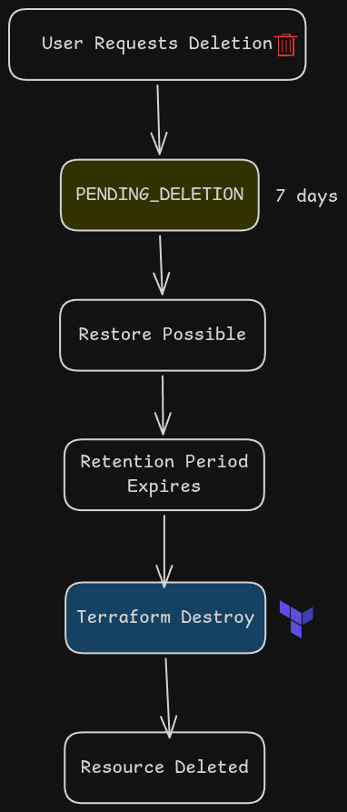

# Resource Deletion Workflow

## Overview

Deleting cloud resources is a high-risk operation. Most organizations implement approval workflows and delayed deletion mechanisms to prevent accidental data loss.

---

# Standard Deletion Flow

## Step 1: User Requests Deletion

A user requests deletion of a resource.

### Example

User clicks:

```text
Delete Bucket
```

The API creates a deletion request record and stores it in DynamoDB.

```json
{
  "requestId": "req-123",
  "resourceId": "bucket-001",
  "action": "DELETE",
  "status": "PENDING_APPROVAL"
}
```


## Step 2: Approval Required

The platform displays:

```text
Deletion Request Pending Approval
```

A manager receives a notification through one of the following channels:

* Email
* Slack
* Microsoft Teams
* Internal Portal


## Step 3: Manager Approves

The manager reviews the request and clicks:

```text
Approve
```

The request status is updated:

```json
{
  "status": "APPROVED"
}
```


## Step 4: Publish Message to SQS

After approval, the system publishes a message to Amazon SQS.

```json
{
  "requestId": "req-123",
  "action": "DELETE",
  "resourceId": "bucket-001"
}
```


## Step 5: Worker Executes Deletion

A worker service consumes the SQS message.

```python
if body["action"] == "DELETE":
    terraform_destroy()
```

The worker executes the Terraform destroy workflow.


## Step 6: Resource Removed

Terraform destroys all associated infrastructure.

### Example Resources Removed

* S3 Bucket
* Bucket Policies
* Bucket Encryption
* Versioning Configuration
* Lifecycle Rules

---

# Best Practice: Two-Stage Deletion

Many organizations use a delayed deletion process.

## User Requests Deletion

Resource status becomes:

```text
PENDING_DELETION
```

instead of being immediately destroyed.


## Grace Period (7 Days)

During the retention period:

* Resource remains recoverable
* User can cancel deletion
* No infrastructure is destroyed

### Restore Operation

If the user restores the resource:

```text
ACTIVE
```

The resource returns to normal operation.


## Automatic Cleanup

After the retention period expires, an automated worker executes:

```bash
terraform destroy
```

This permanently removes the infrastructure.

### Benefits

* Prevents accidental deletions
* Allows recovery of critical resources
* Improves operational safety

---

# Environment-Based Deletion Policies

Different environments usually have different deletion controls.

## Development Environment

```text
Create Resource
      ↓
Delete Resource
```

* No approval required
* Fast iteration for developers


## Staging Environment

```text
Create Resource
      ↓
Delete Resource
```

* Approval may be required
* Depends on organizational policy

---
### Delete Resources


For critical environments, organizations often add:

### Delete Resources Retention Period


This approach significantly reduces the risk of accidental infrastructure deletion.
