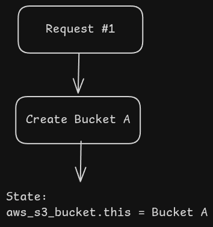
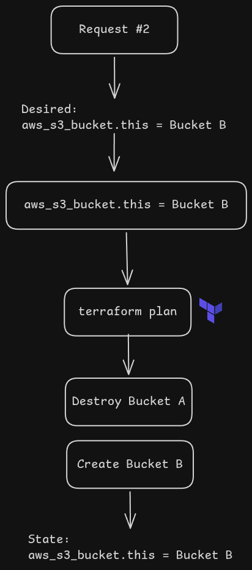

# Problem: Shared Terraform State Causes Resource Replacement

## Overview

The current implementation uses a single Terraform state file:

```text
terraform-state-idp-1
└── dev/terraform.tfstate
```

All provisioning requests share the same state file.

The Terraform configuration contains a single resource:

```hcl
resource "aws_s3_bucket" "this" {
  bucket = var.bucket_name
}
```

Because Terraform tracks resources by their logical name (`aws_s3_bucket.this`), every new request attempts to modify the same resource instead of creating an independent one.

---

## First Provisioning Request

Request:

```json
{
  "bucket_name": "opopopopopopopopopop-390wu34567wjfswjfs"
}
```

Terraform creates the bucket and stores it in the state file:

```text
terraform.tfstate

aws_s3_bucket.this
    =
opopopopopopopopopop-390wu34567wjfswjfs
```

Current Infrastructure:

```text
aws_s3_bucket.this
└── opopopopopopopopopop-390wu34567wjfswjfs
```

---

## Second Provisioning Request

Request:

```json
{
  "bucket_name": "app-0i890iyhj"
}
```

Terraform loads the existing state:

```text
Current State

aws_s3_bucket.this
=
opopopopopopopopopop-390wu34567wjfswjfs
```

Desired Configuration:

```text
aws_s3_bucket.this
=
app-0i890iyhj
```

Terraform compares:

```text
Current:
opopopopopopopopopop-390wu34567wjfswjfs

Desired:
app-0i890iyhj
```

Since the bucket name changed, Terraform determines that the resource must be replaced.

---

## Terraform Execution Plan

Terraform generates a plan similar to:

```text
-/+ aws_s3_bucket.this

bucket:
  "opopopopopopopopopop-390wu34567wjfswjfs"
      ->
  "app-0i890iyhj"
```

Execution:

```text
- Destroy old bucket
+ Create new bucket
```

---

## Result

Terraform performs the following actions:

```text
Bucket #1 Deleted
└── opopopopopopopopopop-390wu34567wjfswjfs

Bucket #2 Created
└── app-0i890iyhj
```

Final Infrastructure:

```text
aws_s3_bucket.this
└── app-0i890iyhj
```

The first customer's bucket no longer exists.

---

## Why This Happens

Terraform does not identify resources by their actual AWS names.

Terraform identifies resources by:

```text
<Resource Type>.<Resource Name>

aws_s3_bucket.this
```

Since every request uses the same resource definition:

```hcl
resource "aws_s3_bucket" "this" {
  bucket = var.bucket_name
}
```

Terraform assumes each new request is an update to the existing resource rather than a request for a new independent resource.

---

## Impact

Using a shared state file can lead to:

* Accidental deletion of previously provisioned infrastructure.
* Infrastructure drift between customers.
* Loss of customer resources.
* Unsafe multi-tenant provisioning.
* Inability to provision multiple buckets independently.

---

## Example Timeline





---

## Solution

Each provisioning request should have its own Terraform state file.

Example:

```text
terraform-state-idp-1
├── request-001.tfstate
├── request-002.tfstate
├── request-003.tfstate
└── ...
```

or

```text
terraform-state-idp-1
├── customer-a/terraform.tfstate
├── customer-b/terraform.tfstate
└── customer-c/terraform.tfstate
```

This ensures that each resource is managed independently and prevents Terraform from replacing infrastructure created for previous requests.
