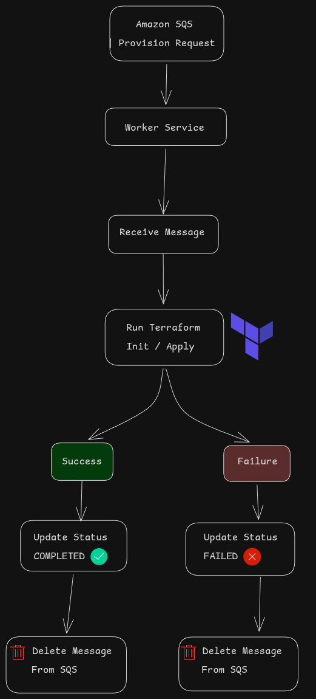
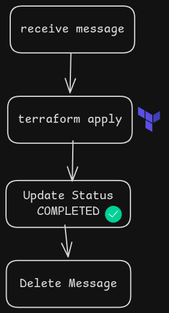
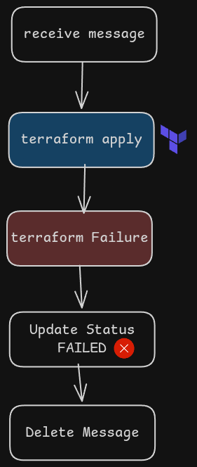

# Message Processing & Terraform Provisioning Workflow

## Overview

This service acts as a worker that continuously polls messages from Amazon SQS and provisions cloud infrastructure using Terraform.

Each provisioning request follows a simple lifecycle:

1. Receive a provisioning request from SQS.
2. Execute Terraform to create the requested infrastructure.
3. Update the provisioning status.
4. Remove the processed message from the queue.

---

---

### Steps

1. Worker receives a provisioning request from SQS.
2. Required Terraform variables are generated.
3. Terraform initialization (`terraform init`) is executed.
4. Terraform apply (`terraform apply`) creates the infrastructure.
5. DynamoDB status is updated to `COMPLETED`.
6. Processed message is removed from the SQS queue.

---

### Steps

1. Worker receives a provisioning request from SQS.
2. Terraform execution starts.
3. An error occurs during initialization or apply.
4. DynamoDB status is updated to `FAILED`.
5. Error details are logged for troubleshooting.
6. Message is removed from SQS to prevent infinite retries.

---

## Components

### Amazon SQS

Acts as the request queue.

Responsibilities:

* Stores provisioning requests.
* Decouples API and provisioning worker.
* Ensures asynchronous processing.

---

### Worker Service

Python-based background service responsible for:

* Polling SQS.
* Processing provisioning requests.
* Executing Terraform commands.
* Updating provisioning status.
* Cleaning up processed messages.

---

### Terraform

Infrastructure as Code (IaC) engine used for:

* Creating AWS resources.
* Managing infrastructure state.
* Provisioning resources consistently and repeatably.

---

### DynamoDB

Stores provisioning request metadata and status.

Example statuses:

| Status      | Description                         |
| ----------- | ----------------------------------- |
| PENDING     | Request received                    |
| IN_PROGRESS | Terraform execution started         |
| PROVISIONED | Infrastructure created successfully |
| FAILED      | Infrastructure provisioning failed  |

---

## Reliability Considerations

* Messages are deleted only after processing is completed.
* Failures are recorded in DynamoDB for visibility.
* Infrastructure provisioning remains asynchronous.
* API response times are not impacted by Terraform execution.
* Worker can be horizontally scaled to process multiple requests concurrently.

