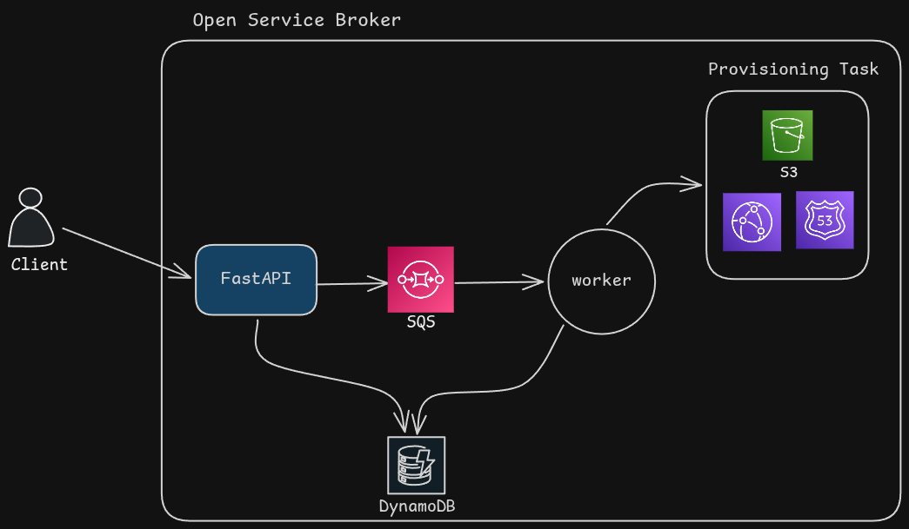

# Internal Developer Platform (IDP)

A small Internal Developer Platform built to automate AWS infrastructure provisioning through a self-service workflow.

The goal of this project is to remove manual infrastructure creation and provide a foundation for an internal platform where developers can request cloud resources through an API instead of logging into AWS and creating them by hand.

At the moment, the platform supports provisioning **Amazon S3 buckets**. Additional AWS resources such as Route53 records, CloudFront distributions, IAM resources, and databases are planned for future iterations.

---

## Why I Built This

In many teams, developers need infrastructure resources such as buckets, databases, DNS records, or load balancers. These requests are often handled manually by DevOps or Platform teams.

A typical workflow looks like:

1. Developer creates a ticket.
2. Platform engineer reviews the request.
3. Infrastructure is created manually.
4. Status is communicated back to the requester.

This process does not scale well.

This project explores a self-service approach where infrastructure requests are submitted through an API and processed asynchronously by worker services.

---
## Architecture

---

## Request Lifecycle

When a provisioning request is submitted:

1. FastAPI receives the request.
2. A request record is stored in DynamoDB with status `PENDING`.
3. A message is published to Amazon SQS.
4. The worker consumes the message.
5. The request status is updated to `PROCESSING`.
6. Terraform provisions the requested infrastructure.
7. Status is updated to either:

   * `COMPLETED`
   * `FAILED`
8. The SQS message is removed after processing.

---

## Current Features

### S3 Bucket Provisioning

Provision S3 buckets using Terraform through an API request.

### Asynchronous Processing

Infrastructure creation is handled through Amazon SQS and worker processes instead of blocking API requests.

### Request Tracking

Every provisioning request is stored and tracked inside DynamoDB.

Supported states:

* PENDING
* PROCESSING
* COMPLETED
* FAILED

### Error Visibility

Terraform failures are captured and stored with the request record to simplify debugging.

### Operational Endpoints

The API currently exposes endpoints for:

* Creating provisioning requests
* Viewing request history
* Viewing platform statistics
* Health checks

---
### Flow

---

## Tech Stack

### Backend

* FastAPI
* Python

### Infrastructure Automation

* Terraform

### AWS Services

* Amazon SQS
* Amazon DynamoDB
* Amazon S3

### Worker Runtime

* Python
* Boto3

---

## Current Status

This is an actively evolving project.

Implemented:

* S3 Bucket Provisioning
* Request Tracking
* SQS-based Processing
* Terraform Integration
* Status Management
* Health and Metrics APIs

---

## Learned

Building this project helped me understand:

* Event-driven architectures
* Asynchronous workload processing
* Terraform automation from application code
* Infrastructure lifecycle management
* AWS service integration using Boto3
* Designing platform engineering workflows

---

## Demo video

## License

Copyright © 2026 durgax04. All rights reserved. 
